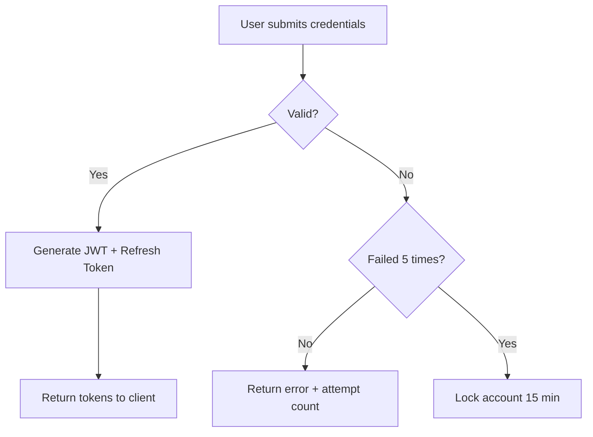

# Using GitHub Copilot as a Team — A Complete Guide

> **Who is this for?** Every developer on the team, from juniors to seniors.
> No prior Copilot experience needed. Read this once and you'll know exactly what to do.

---

## 🧭 Table of Contents

1. [The Big Idea: What We're Doing Differently](#1-the-big-idea)
2. [The Vocabulary: One Word for Everything](#2-the-vocabulary)
3. [The Phases: How Every Issue Gets Built](#3-the-phases)
4. [Setting Up Copilot in VS Code (5 minutes)](#4-setting-up-copilot)
5. [Your Project's Brain: Understanding the Docs Folder](#5-the-docs-folder)
6. [Feature Docs: One File Per Feature/Flow](#6-feature-docs)
7. [API Docs: One File Per API](#7-api-docs)
8. [How a Developer Works Day-to-Day](#8-day-to-day-workflow)
9. [Working in Parallel Without Conflicts](#9-parallel-work-without-conflicts)
10. [The Agents and Slash Commands](#10-agents-and-slash-commands)
11. [Skills: Teaching Copilot Your Project Patterns](#11-skills)
12. [Hooks: Automatic Enforcement](#12-hooks)
13. [For Team Leads: Setting This Up](#13-for-team-leads)
14. [Quick Reference Card](#14-quick-reference)

---

## 1. The Big Idea

### Why are we doing this?

Right now, when a developer asks Copilot to help with code, Copilot doesn't know:
- What our project actually does
- How our APIs are structured
- Our team's coding rules
- What other developers are working on
- What decisions were already made

So every time, you have to explain everything from scratch. This wastes time and produces inconsistent code.

### What changes with our setup

We give Copilot a **structured knowledge base** — a well-organized `docs/` folder where every feature, every API, every flow has its own file. When a developer works on something, Copilot reads the right doc file and works with full context.

```
Before (without setup):
Developer: "Help me with the login API"
Copilot: "Sure! Here's a generic login endpoint..."
Developer: "No wait, we use JWT, not sessions. And we have rate limiting..."
[30 minutes of back and forth]

After (with our setup):
Developer: /work-on auth-login-api
Copilot: [reads docs/apis/auth/login.api.md automatically]
Copilot: "I see you're working on the login endpoint. You're using JWT, bcrypt
           for hashing, and have rate limiting from our middleware. Here's the plan..."
[Starts immediately, correctly]
```

### The three principles

1. **One doc per thing** — Every feature, every API has exactly one documentation file
2. **Agent-driven work** — Copilot reads, plans, executes, and updates docs — not just writes code
3. **Parallel-friendly** — Multiple developers can work simultaneously without stepping on each other

---

## 2. The Vocabulary

We use one word for everything you work on: a **Issue** 🧱

### What is a Issue?

A Issue is any single unit of work. It doesn't matter if it's:
- A new feature (User Authentication)
- A bug fix (Login fails with special characters)
- A story (As a user, I want to reset my password)
- A task (Add rate limiting to login endpoint)
- An improvement (Optimize query performance on orders API)

**They're all Issues.** Every Issue goes through the same phases.

### Why "Issue"?

Because your project is built from Issues. Each is small, well-defined, and fits neatly with others. When you're done, you have a solid structure.

### Issue anatomy

Every Issue has:
- **A unique ID**: `ISSUE-001`, `ISSUE-042`
- **A type**: `feature` | `fix` | `story` | `task` | `improvement`
- **A status**: `discuss` → `research` → `plan` → `execute` → `verify` → `done`
- **A doc file**: `docs/Issues/ISSUE-042-login-rate-limiting.md`
- **An owner**: The developer currently working on it

---

## 3. The Phases

Every Issue goes through 5 phases. Copilot helps with all of them.

```
┌─────────────┐    ┌─────────────┐    ┌─────────────┐    ┌─────────────┐    ┌─────────────┐
│   DISCUSS   │ →  │  RESEARCH   │ →  │    PLAN     │ →  │   EXECUTE   │ →  │   VERIFY    │
│             │    │             │    │             │    │             │    │             │
│ What are we │    │ Where does  │    │ How exactly │    │ Build it    │    │ Does it     │
│ building?   │    │ this fit?   │    │ will we     │    │ with tests  │    │ work? Is    │
│ Why? Who    │    │ What exists │    │ build this? │    │ Write docs  │    │ it correct? │
│ needs it?   │    │ already?    │    │             │    │             │    │             │
└─────────────┘    └─────────────┘    └─────────────┘    └─────────────┘    └─────────────┘
  /discuss            /research          /plan              /execute            /verify
  agent               agent              agent              agent               agent
```

### Phase 1: Discuss 🗣️

**Goal**: Understand *what* we're building and *why*.

You open a new Copilot chat, select the **Discuss** agent, and describe the Issue:

```
"We need to add rate limiting to the login API.
  Right now users can try unlimited login attempts.
  We want to block after 5 failed attempts for 15 minutes."
```

Copilot asks clarifying questions:
- Should this be per-IP or per-email?
- What happens to logged-in users on the same IP?
- Should admins be exempt?

At the end: A short summary of agreed requirements is saved to your Issue doc.

**Copilot updates**: `docs/Issues/ISSUE-042-login-rate-limiting.md` → Phase: Discuss ✅

---

### Phase 2: Research 🔍

**Goal**: Understand *what already exists* and how this Issue fits in.

You switch to the **Research** agent:

```
"Research where login rate limiting should live in our codebase.
 Check our existing middleware, auth service, and Redis setup."
```

Copilot reads your codebase and answers:
- "Your auth middleware is in `src/middleware/auth.ts`"
- "You already use Redis for session caching at `src/utils/redis.ts`"
- "Similar rate limiting exists for OTP in `src/middleware/otp-rate-limit.ts` — we can follow this pattern"

**Copilot updates**: `docs/Issues/ISSUE-042-login-rate-limiting.md` → Research notes added, Phase: Research ✅

---

### Phase 3: Plan 📋

**Goal**: Decide *exactly how* we'll build it before writing a single line of code.

You switch to the **Plan** agent:

```
"Create an implementation plan for login rate limiting.
 Use the research notes from docs/Issues/ISSUE-042-login-rate-limiting.md"
```

Copilot creates a structured plan:
- Files to create/modify
- Database/Redis schema changes
- API changes
- Test scenarios to cover
- Acceptance criteria

You review the plan and approve it (or ask for changes).

**Copilot updates**: `docs/Issues/ISSUE-042-login-rate-limiting.md` → Plan section complete, Phase: Plan ✅

> **Rule**: No coding until the Plan is approved. This prevents wasted work.

---

### Phase 4: Execute 🔨

**Goal**: Build it, with tests, exactly as planned.

You switch to the **Execute** (TDD) agent:

```
"Execute the plan in docs/Issues/ISSUE-042-login-rate-limiting.md"
```

Copilot:
1. Follows the plan task by task
2. Writes tests FIRST (TDD)
3. Implements the code to pass tests
4. Runs the test suite after each task
5. Commits after each passing test cycle

**Copilot updates**: 
- `docs/Issues/ISSUE-042-login-rate-limiting.md` → Execution notes, progress tracker updated
- `docs/apis/auth/login.api.md` → "Rate limiting" section added to the API doc

---

### Phase 5: Verify ✅

**Goal**: Confirm it works correctly and meets requirements.

You switch to the **Verify** agent:

```
"Verify the login rate limiting feature is complete and correct"
```

Copilot checks:
- All planned tasks are complete
- Tests pass (unit, integration, E2E)
- The original requirements from Phase 1 are met
- API documentation is updated
- No regressions in related tests

It produces a verification report.

**Copilot updates**: `docs/Issues/ISSUE-042-login-rate-limiting.md` → Verification report, Phase: Verify ✅, Status: Done

---

## 4. Setting Up Copilot

### Step 1: Install VS Code extensions

1. Open VS Code
2. Install: **GitHub Copilot** (official extension)
3. Install: **GitHub Pull Requests** (for Copilot coding agent)
4. Sign in with your GitHub account

### Step 2: Clone the project

```bash
git clone [your-repo-url]
cd your-project
```

The `.github/` folder already contains our team's Copilot configuration. You don't need to set anything up — it works automatically.

### Step 3: Open Copilot Chat

- Press `Ctrl+Shift+I` (Windows) or `Cmd+Shift+I` (Mac)
- Or click the Copilot icon in the left sidebar

### Step 4: Learn the slash commands

Type `/` in the chat to see all available commands. The main ones are:

| Command | What it does |
|---------|-------------|
| `/discuss` | Start discussing a new Issue |
| `/research` | Research where something fits in the codebase |
| `/plan` | Create an implementation plan |
| `/execute` | Implement a plan |
| `/verify` | Verify implementation is complete and correct |
| `/code-review` | Review current file or changes |
| `/write-tests` | Write tests for current file |
| `/update-api-doc` | Update the API doc for a changed endpoint |

### Step 5: Know your agents

Click the agent dropdown in the chat (next to the input field). You'll see:

- **Planner** — For Phase 3 (Plan). Read-only, no code changes.
- **TDD** — For Phase 4 (Execute). Writes tests first, then code.
- **Reviewer** — For code reviews. Never edits, only reports.
- **Discuss** — For Phase 1. Asks questions, defines scope.
- **Research** — For Phase 2. Reads codebase, explains context.
- **Verify** — For Phase 5. Checks completeness and correctness.

---

## 5. The Docs Folder

This is the most important concept. Every piece of knowledge lives in `docs/`.

### What Copilot does before it helps you

Before Copilot starts any work, it reads the relevant docs. Think of it as briefing a new team member before they start a task.

The `docs/` folder is organized so that Copilot loads **only what's relevant** — not the entire project. This keeps it fast and accurate.

### Complete Folder Structure

```
docs/
│
├── PROJECT.md                        ← Top-level project overview (Copilot reads this always)
├── ARCHITECTURE.md                   ← System design and technology decisions
├── CONTRIBUTING.md                   ← Team conventions and coding standards
│
├── flows/                            ← One file per user journey
│   ├── auth-flow.md                  ← Sign up, Login, Logout, Password Reset
│   ├── quotation-flow.md             ← Quote creation, approval, revision
│   ├── order-flow.md                 ← Order creation to fulfillment
│   ├── track-order-flow.md           ← Order tracking from dispatch to delivery
│   ├── payment-flow.md               ← Payment initiation, processing, refunds
│   └── [add as needed]
│
├── apis/                             ← One file per API endpoint
│   ├── auth/
│   │   ├── register.api.md
│   │   ├── login.api.md
│   │   ├── logout.api.md
│   │   ├── refresh-token.api.md
│   │   └── forgot-password.api.md
│   ├── orders/
│   │   ├── create-order.api.md
│   │   ├── get-order.api.md
│   │   ├── update-order.api.md
│   │   ├── cancel-order.api.md
│   │   └── list-orders.api.md
│   ├── quotations/
│   │   ├── create-quotation.api.md
│   │   ├── approve-quotation.api.md
│   │   └── [more APIs...]
│   ├── tracking/
│   │   └── track-order.api.md
│   └── [add folders per domain]
│
├── Issues/                           ← One file per active Issue (work item)
│   ├── ISSUE-001-user-auth.md        ← A completed Issue (archived)
│   ├── ISSUE-042-login-rate-limiting.md  ← Active Issue
│   └── ISSUE-043-quotation-export.md ← Planned Issue
│
├── decisions/                        ← Why we made certain choices
│   ├── ADR-001-jwt-over-sessions.md
│   ├── ADR-002-redis-for-caching.md
│   └── ADR-003-pagination-strategy.md
│
└── team-notes/                       ← Async team communication
    ├── [developer-name]/             ← Each dev has their own folder
    │   └── notes-ISSUE-042.md        ← No merge conflicts!
    └── shared/
        └── standup-notes.md
```

### How Copilot finds the right doc

When you say "help me with the login API", Copilot reads:
1. `docs/PROJECT.md` (always — project overview)
2. `docs/apis/auth/login.api.md` (specific to what you're asking)
3. `docs/flows/auth-flow.md` (the flow context)
4. `.github/instructions/backend.instructions.md` (team coding standards for backend)

It does NOT load every file in the project. This is efficient and accurate.

---

## 6. Feature Docs (Flows)

Each user journey gets one doc in `docs/flows/`. Here's what goes in it:

### Template: `docs/flows/[flow-name]-flow.md`

```markdown
---
flow-id: "auth-flow"
last-updated: "2026-03-01"
owner: "Backend Team"
status: "stable"  # stable | in-progress | deprecated
related-apis: ["auth/login", "auth/register", "auth/logout", "auth/refresh-token"]
---

# Authentication Flow

## Overview
[2-3 sentences: what does this flow do? Who uses it? Why does it exist?]

## User Journey
[The steps a user goes through — from their perspective, not code perspective]

1. User enters email and password on login screen
2. System validates credentials
3. If valid: returns JWT access token (15 min) + refresh token (7 days)
4. If invalid: returns error with attempt count
5. After 5 failures: account locked for 15 minutes

## Flow Diagram
[Simple ASCII or Mermaid diagram showing the flow]



## APIs in this Flow
- `POST /api/auth/register` → [docs/apis/auth/register.api.md](../apis/auth/register.api.md)
- `POST /api/auth/login` → [docs/apis/auth/login.api.md](../apis/auth/login.api.md)
- `POST /api/auth/logout` → [docs/apis/auth/logout.api.md](../apis/auth/logout.api.md)
- `POST /api/auth/refresh` → [docs/apis/auth/refresh-token.api.md](../apis/auth/refresh-token.api.md)

## Key Business Rules
- Email must be verified before login is allowed
- Rate limiting: 5 attempts per email per 15 minutes
- JWT access tokens expire in 15 minutes
- Refresh tokens expire in 7 days and are single-use (rotated)

## Database Tables Used
- `users` — stores credentials
- `refresh_tokens` — stores active refresh tokens
- `login_attempts` — tracks failed attempts per email+IP

## Error Scenarios
| Scenario | HTTP Code | Error Message |
|----------|-----------|---------------|
| Invalid credentials | 401 | "Invalid email or password" |
| Account locked | 429 | "Account temporarily locked. Try again in X minutes" |
| Email not verified | 403 | "Please verify your email before logging in" |
| Token expired | 401 | "Session expired. Please log in again" |

## Change History
| Date | Change | Developer |
|------|--------|-----------|
| 2026-03-01 | Added rate limiting | John |
| 2026-02-15 | Added refresh token rotation | Sarah |
```

---

## 7. API Docs

Each API endpoint gets its own file in `docs/apis/[domain]/`. This is your most important reference.

### Template: `docs/apis/[domain]/[endpoint-name].api.md`

```markdown
---
api-id: "auth-login"
endpoint: "POST /api/auth/login"
status: "stable"  # stable | deprecated | beta
version: "v1"
last-updated: "2026-03-01"
related-flow: "auth-flow"
owner: "Backend Team"
---

# POST /api/auth/login

## Purpose
Authenticates a user with email and password. Returns JWT access and refresh tokens.

## Authentication
❌ Not required (this IS the authentication endpoint)

## Request

### Headers
```
Content-Type: application/json
```

### Body
```json
{
  "email": "user@example.com",     // required, valid email format
  "password": "SecurePass123!"     // required, min 8 chars
}
```

## Response

### Success (200 OK)
```json
{
  "accessToken": "eyJhbGci...",    // JWT, expires in 15 minutes
  "refreshToken": "a1b2c3...",     // UUID, expires in 7 days
  "user": {
    "id": "usr_01HZ...",
    "email": "user@example.com",
    "name": "John Doe",
    "role": "customer"
  }
}
```

### Error Responses
| Status | Code | Message | When |
|--------|------|---------|------|
| 400 | `VALIDATION_ERROR` | "Invalid email format" | Bad request format |
| 401 | `INVALID_CREDENTIALS` | "Invalid email or password" | Wrong credentials |
| 403 | `EMAIL_NOT_VERIFIED` | "Please verify your email" | Unverified account |
| 429 | `RATE_LIMIT_EXCEEDED` | "Too many attempts. Try in X min" | 5+ failures |
| 500 | `SERVER_ERROR` | "An error occurred" | Internal failure |

## Business Rules
- Rate limit: 5 failed attempts per email → 15-minute lockout
- Rate limit window resets on successful login
- Refresh token is single-use (new one issued each time)
- Stores login attempt metadata (IP, timestamp) for security

## Implementation
- **Route file**: `src/api/auth/route.ts`
- **Service**: `src/services/auth.service.ts` → `loginUser()`
- **Repository**: `src/repositories/user.repository.ts`
- **Middleware**: `rateLimiter('login')` applied before handler

## Related Tests
- Unit: `src/services/auth.service.test.ts` → `describe('loginUser')`
- Integration: `tests/integration/auth/login.test.ts`
- E2E: `tests/e2e/auth-flow.spec.ts` → `test('user can log in')`

## Change History
| Date | Change | Developer | Issue |
|------|--------|-----------|-------|
| 2026-03-01 | Added rate limiting | John | ISSUE-042 |
| 2026-02-20 | Initial endpoint | Sarah | ISSUE-001 |
```

---

## 8. Day-to-Day Workflow

### Starting your day

1. **Pull latest changes** from main: `git pull origin main`
2. **Check your current Issue**: `docs/Issues/ISSUE-XXX-your-Issue.md`
3. **Continue from where you left off** by telling Copilot:
   ```
   "I'm continuing work on ISSUE-042. 
    Read docs/Issues/ISSUE-042-login-rate-limiting.md for context."
   ```

### Starting a new Issue

1. Create a new branch: `git checkout -b issue/ISSUE-043-feature-name`
2. Create the Issue doc: `docs/Issues/ISSUE-043-feature-name.md`
   - Use the template from `docs/templates/ISSUE-template.md`
3. Open Copilot Chat, select **Discuss** agent
4. Start discussing the Issue requirements
5. Progress through Phase 1 → 2 → 3 → 4 → 5

### During execution

Your chat session for a Issue should:
- Start with: `"I'm working on ISSUE-042. Read #docs/Issues/ISSUE-042-login-rate-limiting.md"`
- Reference specific API docs when working on endpoints: `#docs/apis/auth/login.api.md`
- Reference flow docs for context: `#docs/flows/auth-flow.md`

### Ending your day

Before you commit and stop, always ask Copilot:

```
"Update all docs for what we completed today:
 1. Update the Issue doc with today's progress and notes
 2. Update any API docs we changed
 3. Summarize what's done and what's remaining"
```

Copilot will update the docs. Commit everything together: `git commit -m "feat: ISSUE-042 rate limiting + docs update"`

### Creating a PR

```
/create-pr-description
```

The PR description automatically includes:
- What was built (from Issue doc)
- What APIs changed (from API docs)
- How to test it (from Verify phase notes)

---

## 9. Parallel Work Without Conflicts

### The problem

When two developers both update `docs/orders/order-flow.md`, a merge conflict happens. This is annoying and slows everyone down.

### Our solution: Team Notes + Feature Branches + Clear Ownership

**Rule 1: One developer owns each Issue**

Only one developer works on a Issue at a time. The Issue doc is their file.

**Rule 2: Personal notes in personal folders**

For day-to-day notes and context, each developer has their own folder:
```
docs/team-notes/john/
docs/team-notes/sarah/
docs/team-notes/rahul/
```

No one else touches your folder. No conflicts.

**Rule 3: Feature branches for Issue docs**

When you work on `ISSUE-042`, your branch is: `issue/ISSUE-042-login-rate-limiting`

Your Issue doc `docs/Issues/ISSUE-042-login-rate-limiting.md` exists ONLY on your branch until you merge. No conflicts with other developers.

**Rule 4: API docs update on merge**

API docs (`docs/apis/`) are only updated when a Issue is DONE and merged to main. One update per PR. No mid-work conflicts.

**Rule 5: Flow docs are owned by the team lead**

Each flow doc is reviewed and updated by the team lead when changes are merged. Developers don't directly edit flow docs — they note changes needed in their Issue doc.

### Visual Example

```
main branch:
  docs/apis/auth/login.api.md  ← Stable, reviewed version

Developer 1 (branch: issue/ISSUE-042):
  docs/Issues/ISSUE-042-login-rate-limiting.md  ← Their file, no conflicts
  docs/apis/auth/login.api.md  ← Updated on their branch, merged via PR

Developer 2 (branch: issue/ISSUE-043):
  docs/Issues/ISSUE-043-quotation-export.md  ← Their file, no conflicts
  docs/apis/quotations/create-quotation.api.md  ← Different file, no conflicts
```

### Team notes for coordination

When you want to let a teammate know something during a Issue:

```markdown
# docs/team-notes/john/notes-ISSUE-042.md

## Day 1 Notes
- Discovered: The existing OTP rate limiter in src/middleware/otp-rate-limit.ts
  uses a different Redis key pattern than what I planned — should align
- Question for Rahul: Does the admin bypass apply to the API or the UI level?
- Blocked: Waiting for answer on admin bypass question

## Day 2 Notes  
- Admin bypass → API level (confirmed by Rahul)
- Rate limiting using sliding window, not fixed window (better for UX)
```

Your teammates read this during standup. No meetings needed.

---

## 10. The Agents and Slash Commands

### Understanding the difference

**Agents = Personas** (who Copilot is acting as)
- The Planner is an architect who only thinks, never codes
- The TDD agent is a disciplined developer who writes tests first
- The Reviewer is a senior engineer who searches for problems

**Slash Commands = Tasks** (standalone workflows)
- `/code-review` is a one-shot review
- `/write-tests` generates tests for what you have open
- `/update-api-doc` updates the API doc for a changed endpoint

### The 6 Workflow Agents

Select these from the agent dropdown in Copilot Chat:

#### 🗣️ Discuss Agent
- **Use when**: Starting a new Issue
- **What it does**: Asks questions to define scope and requirements
- **Output**: Requirements summary in your Issue doc
- **Example prompt**: `"We want to add export to PDF for quotations"`

#### 🔍 Research Agent
- **Use when**: After discussing, before planning
- **What it does**: Reads the codebase to find existing patterns, understand context
- **Output**: Research notes in your Issue doc
- **Example prompt**: `"Research where PDF export would fit in our quotation service"`

#### 📋 Plan Agent
- **Use when**: After research, before coding
- **What it does**: Creates a detailed implementation plan
- **Output**: Plan section in your Issue doc
- **Example prompt**: `"Plan the PDF export using research from ISSUE-043"`

#### 🔨 Execute (TDD) Agent
- **Use when**: After plan is approved
- **What it does**: Writes tests first, then implements, commits frequently
- **Output**: Working code + tests + updated notes in Issue doc
- **Example prompt**: `"Execute the plan in ISSUE-043"`

#### ✅ Verify Agent
- **Use when**: After execution, before PR
- **What it does**: Checks completeness, tests, and docs alignment
- **Output**: Verification report in Issue doc
- **Example prompt**: `"Verify ISSUE-043 is complete and ready to merge"`

#### 🔎 Reviewer Agent
- **Use when**: Reviewing a teammate's PR
- **What it does**: Parallel review across security, performance, correctness, standards
- **Output**: Prioritized review findings
- **Example prompt**: `"Review the changes in this PR"` (uses `/code-review` prompt)

### The Slash Commands Reference

| Command | Select agent first? | Use when |
|---------|-------------------|----------|
| `/discuss` | No (has its own flow) | Starting a Issue |
| `/research` | No | After discuss phase |
| `/plan` | No | Creating implementation plan |
| `/execute` | No | Implementing from plan |
| `/verify` | No | Checking completeness |
| `/code-review` | No | Reviewing any file/PR |
| `/write-tests` | No | Generating tests for open file |
| `/update-api-doc` | No | After changing an API |
| `/create-pr-description` | No | Before creating a PR |
| `/fix-bug` | No | Debugging a bug |

---

## 11. Skills

Skills are **templates of knowledge** that Copilot loads when relevant. They're more powerful than instructions because they include examples.

### Our Project's Skills

These are in `.github/skills/`:

| Skill | When Copilot loads it |
|-------|----------------------|
| `api-patterns` | When you're working on any API endpoint |
| `testing-strategy` | When you're writing tests |
| `database-patterns` | When you're writing queries or migrations |
| `error-handling` | When you're adding error handling |
| `authentication-patterns` | When you're working on auth-related code |

### How they help

Without skills: "Create a new order API endpoint"
→ Copilot creates a generic endpoint

With `api-patterns` skill: "Create a new order API endpoint"
→ Copilot creates an endpoint following YOUR project's structure, middleware, error format, validation style — because it read the skill

### Creating a skill

If you see Copilot making the same mistake repeatedly, create a skill:

1. Create a folder: `.github/skills/my-pattern/`
2. Create `SKILL.md` in it with the correct pattern
3. Copilot will load it automatically when relevant

---

## 12. Hooks

Hooks run automatically in the background — you don't do anything. They enforce team standards without you thinking about it.

### What our hooks do

**After every file edit:**
→ Prettier formatting runs automatically. Your code is always formatted.

**Before any terminal command runs:**
→ Dangerous commands (`rm -rf`, `DROP TABLE`) are blocked automatically.

**When a new session starts:**
→ Project info (branch name, project name) is injected into context.

You don't need to configure any of this — it just works.

---

## 13. For Team Leads: Setting This Up

If you're setting up Copilot for your project from scratch:

### Step 1: Create the docs structure (30 minutes)

```bash
mkdir -p docs/{flows,apis,Issues,decisions,team-notes,templates}
```

Then:
1. Write `docs/PROJECT.md` — 1-page project overview
2. Write `docs/ARCHITECTURE.md` — 2-page architecture overview
3. Write `docs/CONTRIBUTING.md` — team conventions

### Step 2: Generate initial API docs

For each existing API, run this slash command with the API file open:

```
/generate-api-doc
```

Copilot reads the code and generates the doc. Review and correct it.

### Step 3: Set up `.github/copilot-instructions.md`

This file tells Copilot about the project. It should reference your docs:

```markdown
# [Project Name]

## Key Docs
- [Project Overview](../docs/PROJECT.md)
- [Architecture](../docs/ARCHITECTURE.md)
- [Contributing](../docs/CONTRIBUTING.md)

## Quick Reference
- API docs: `docs/apis/[domain]/[endpoint].api.md`
- Flow docs: `docs/flows/[flow-name]-flow.md`
- Active Issues: `docs/Issues/ISSUE-XXX-name.md`
```

### Step 4: Introduce the team

Run a 1-hour session where each developer:
1. Reads this guide
2. Creates their `docs/team-notes/[their-name]/` folder
3. Practices the `/discuss` → `/plan` → `/execute` flow on a simple task

### Step 5: Start with one Issue as a team

Pick one small feature. Everyone watches the team lead go through all 5 phases using Copilot. Then everyone does their next Issue on their own.

---

## 14. Quick Reference Card

### Every morning checklist
- [ ] `git pull origin main`
- [ ] Open your Issue doc: `docs/Issues/ISSUE-XXX-name.md`
- [ ] Tell Copilot: `"I'm continuing ISSUE-XXX. Read #docs/Issues/ISSUE-XXX-name.md"`

### Every evening checklist
- [ ] Ask Copilot to update all docs for today's work
- [ ] Commit everything: code + docs together
- [ ] Update personal notes: `docs/team-notes/[your-name]/notes-ISSUE-XXX.md`

### Starting a new Issue
1. `git checkout -b issue/ISSUE-XXX-feature-name`
2. Copy `docs/templates/ISSUE-template.md` → `docs/Issues/ISSUE-XXX-name.md`
3. `/discuss` → `/research` → `/plan` → (get approval) → `/execute` → `/verify`

### Agent quick pick
| Phase | Agent to select |
|-------|----------------|
| Discussing requirements | Discuss |
| Researching codebase | Research |
| Creating task plans | Planner |
| Writing code with tests | TDD |
| Reviewing code quality | Reviewer |
| Checking completeness | Verify |

### When in doubt
- If requirements unclear → go back to **Discuss** phase
- If unsure how to implement → do **Research** phase first
- If Copilot goes wrong direction → say "stop, let me re-explain" and start fresh chat
- If context gets confusing → open a new chat session (one session per Issue)

### Contact
Questions about this workflow → [Team Lead Name]
Questions about specific APIs → see `docs/apis/[domain]/` docs
Questions about flows → see `docs/flows/` docs

---

*This guide is a living document. Update it when the workflow evolves.*
*Version: 1.0 | Last updated: March 2026*
