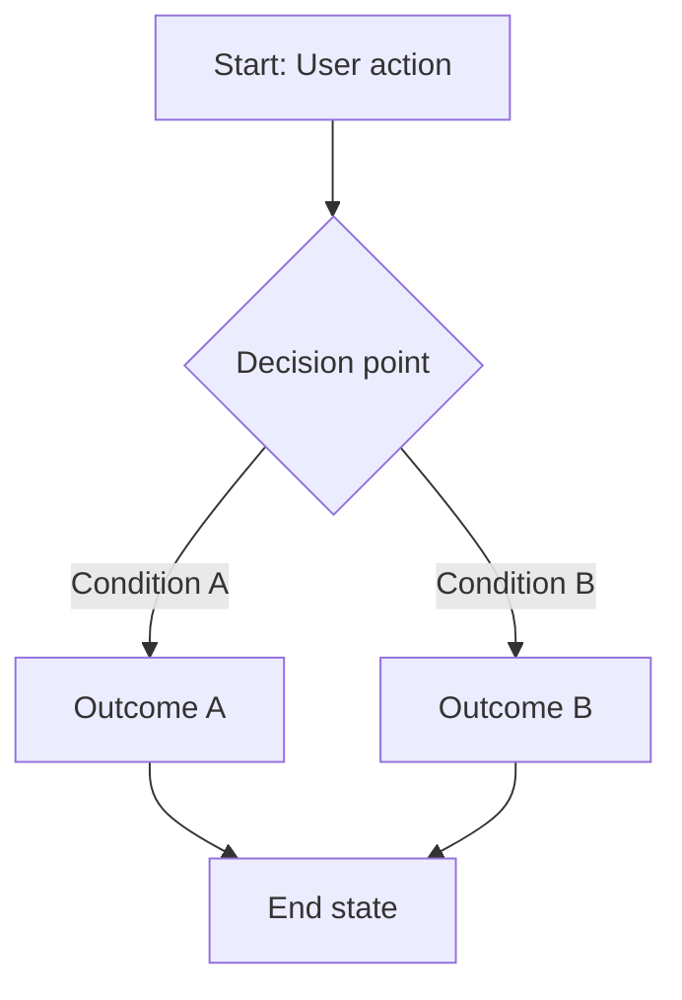

# [Flow Name] Flow

## Overview
[2-3 sentences: what does this flow do? Who uses it? What does it accomplish for the user?]

---

## User Journey

[The steps from the user's perspective — not technical, just the experience]

1. User [does something]
2. System [responds with/shows]
3. User [does the next thing]
4. If [condition]: [outcome A]
5. If [other condition]: [outcome B]

---

## Flow Diagram

---

## APIs in This Flow

| Step | API | Doc |
|------|-----|-----|
| [1. Registration] | `POST /api/[endpoint]` | [link](../apis/[domain]/[endpoint].api.md) |
| [2. Login] | `POST /api/[endpoint]` | [link](../apis/[domain]/[endpoint].api.md) |

---

## Key Business Rules

1. [Rule — e.g., "Email must be verified before the user can proceed to step 3"]
2. [Rule — e.g., "If payment fails, order stays in 'pending' state for 30 minutes"]
3. [Rule — e.g., "Users can only track orders they own"]

---

## Data Involved

### Database Tables
| Table | Role in This Flow |
|-------|-----------------|
| `[table_name]` | [What data it holds for this flow] |

### External Services
| Service | Used For |
|---------|---------|
| [e.g., SendGrid] | [e.g., Sending verification emails] |
| [e.g., Stripe] | [e.g., Processing payments] |

---

## Error Scenarios

| Scenario | What Happens | User Experience |
|----------|-------------|-----------------|
| [Error condition] | [Technical behavior] | [What the user sees] |
| [Error condition] | [Technical behavior] | [What the user sees] |

---

## Related Docs

- Architecture context: [docs/ARCHITECTURE.md](../ARCHITECTURE.md)
- Decision log: [docs/decisions/ADR-XXX.md](../decisions/ADR-XXX.md)

---

## Change History

| Date | Change | Developer | Issue |
|------|--------|-----------|-------|
| YYYY-MM-DD | Initial documentation | [Name] | ISSUE-001 |
| YYYY-MM-DD | [What changed] | [Name] | ISSUE-XXX |
